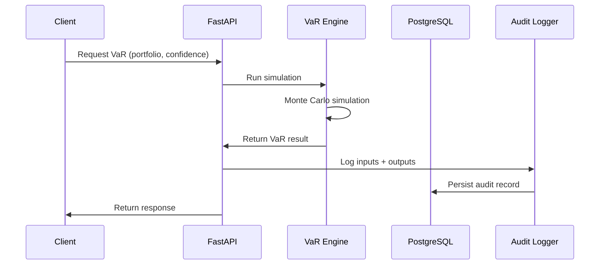

# Real-Time VaR Risk Engine — Design Document

---

## 1. Project Scope

### Objective

Build a **production-grade, real-time Value at Risk (VaR) engine** that simulates and exposes portfolio risk metrics via APIs. The system is designed to mimic financial risk infrastructure used in banks (e.g., HSBC), emphasizing **scalability, auditability, and regulatory alignment**.

### Goals

- Compute VaR using **Monte Carlo simulation**
- Provide **real-time risk evaluation via APIs**
- Support **portfolio-level risk aggregation**
- Ensure **auditability and reproducibility**
- Enable **extensible model framework**

### Non-Goals (MVP)

- Advanced derivatives pricing (e.g., full Black-Scholes implementation)
- Ultra-low latency trading system
- Full regulatory compliance (but simulate key concepts)

---

## 2. Technical Stack

### Core

- **Python** (core language)
- **FastAPI** (API layer)
- **NumPy / SciPy** (Monte Carlo simulation, statistical tests, linear algebra)
- **Pandas** (time series, data processing)

### Data & Storage

- **PostgreSQL** (persistent storage: portfolios, results, audit logs)

### Infrastructure (Phase 3+)

- **Docker** (containerization)
- **Redis** (caching — Phase 3)
- **Kafka** (streaming market data — Phase 3)
- **Kubernetes** (scaling — Phase 4)

### DevOps

- **CI/CD**: GitHub Actions
- **Logging**: Python logging + structured JSON logs

### UI (Phase 4)

- **Streamlit** (risk visualization dashboard)

---

## 3. Detailed Architecture

### High-Level Flow

```mermaid
flowchart LR
    A[Market Data Simulator] --> B[Data Processing Layer]
    B --> C[VaR Engine (Monte Carlo)]
    C --> D[API Layer (FastAPI)]
    C --> E[Audit & Logging Service]
    D --> F[Client / UI]
    E --> G[(PostgreSQL)]
    D --> G
```

### Component Interaction (Request Flow)



### Key Principles

- Separation of concerns: computation vs API vs storage
- Stateless services: computation layer is stateless
- Reproducibility: inputs + model version logged
- Extensibility: plug-in model architecture

---

## 4. Mathematical Model

### 4.1 VaR Methods

This engine implements three standard VaR approaches:

| Method | Assumptions | Strengths | Weaknesses |
|--------|------------|-----------|------------|
| **Monte Carlo** (primary) | Specified stochastic process | Handles non-linear instruments, path-dependent payoffs | Computationally expensive |
| **Parametric (Variance-Covariance)** | Normal returns | Fast, closed-form | Breaks for fat tails, non-linear portfolios |
| **Historical Simulation** | Past returns represent future risk | No distributional assumption | Limited by historical sample size |

Monte Carlo is the primary method because it generalizes to complex portfolios. Parametric and Historical VaR serve as validation benchmarks and demonstrate breadth.

### 4.2 Price Dynamics

Baseline model: **Geometric Brownian Motion (GBM)**

```
dSᵢ = μᵢ Sᵢ dt + σᵢ Sᵢ dWᵢ
```

Discretized (Euler-Maruyama) for simulation:

```
Sᵢ(t+dt) = Sᵢ(t) · exp[(μᵢ - σᵢ²/2)dt + σᵢ √dt · Zᵢ]
```

For **N correlated assets**, generate correlated standard normals using Cholesky decomposition of the correlation matrix **Σ**:

```
W = L · Z,  where LLᵀ = Σ,  Z ~ N(0, I)
```

### 4.3 VaR & Expected Shortfall Computation

Given M simulated portfolio P&L outcomes:

1. Simulate M paths of each asset over horizon T
2. Compute portfolio P&L for each path: `ΔP = Σ wᵢ(Sᵢ(T) - Sᵢ(0))`
3. **VaR** at confidence α: `VaR(α) = -percentile(ΔP, 1 - α)`
4. **Expected Shortfall (CVaR)** at confidence α: `ES(α) = -mean(ΔP | ΔP ≤ -VaR(α))`

ES (also called CVaR or Conditional VaR) measures the expected loss *given* that the loss exceeds VaR. It is coherent (unlike VaR) and is the primary risk measure under **Basel III/IV**.

### 4.4 Parametric VaR (Closed-Form)

For a portfolio with weight vector **w**, mean return vector **μ**, and covariance matrix **Σ**:

```
VaR(α) = -(wᵀμ · T + z(α) · √(wᵀΣw · T))
```

where `z(α)` is the standard normal quantile (e.g., z(0.99) = 2.326).

### 4.5 Parameters

| Parameter | Default | Range |
|-----------|---------|-------|
| Confidence level | 99% | 90%–99.9% |
| Time horizon | 1 day | 1–252 days |
| Simulation count | 10,000 | 1,000–1,000,000 |
| Time step (dt) | 1 day | ≤ horizon |
| Random seed | None | Optional (for reproducibility) |

### 4.6 Model Limitations & Assumptions

Understanding where the model breaks is as important as the model itself:

- **GBM assumes log-normal returns** — real returns exhibit fat tails and skewness. Extreme losses are more frequent than GBM predicts.
- **Constant volatility** — real volatility clusters (GARCH effects). The model underestimates risk during volatile regimes.
- **Stable correlation** — correlation matrices estimated from historical data break down during market stress (correlations spike toward 1 in crises).
- **No transaction costs or liquidity risk** — assumes positions can be liquidated at market price, which fails for illiquid assets.
- **No jump risk** — GBM has continuous paths; real markets gap (e.g., overnight, flash crashes).

Future phases address some of these: fat-tailed distributions (Student-t), stress testing, and variance reduction techniques.

---

## 5. Component Breakdown

### 5.1 Market Data Simulator

Generates synthetic price paths using GBM (see Section 4.2).

- **Inputs:** initial prices (S0), drift (μ), volatility (σ), correlation matrix (Σ), time horizon (T), time step (dt)
- **Outputs:** array of simulated price paths `[n_simulations × n_assets × n_steps]`
- **Seed management:** optional seed parameter for deterministic reproducibility; seed stored in audit log
- **Calibration:** estimate μ and σ from historical log-returns; Σ from rolling window correlation

### 5.2 Data Processing Module

- Converts price series → log-returns: `rₜ = ln(Sₜ / Sₜ₋₁)`
- Computes annualized mean, volatility, and correlation matrix
- Validates inputs (positive prices, sufficient history, positive-definite correlation matrix)

### 5.3 VaR Engine

Core computation module implementing all three VaR methods.

**Key Functions:**

- `simulate_paths(S0, mu, sigma, corr_matrix, T, dt, n_simulations, seed)` → simulated price array
- `calculate_pnl(simulated_prices, portfolio_weights)` → P&L distribution array
- `compute_var(pnl_distribution, confidence_level)` → `(VaR, ES)` tuple
- `parametric_var(returns, weights, confidence, horizon)` → closed-form VaR for validation
- `historical_var(historical_returns, weights, confidence)` → VaR from empirical distribution

### 5.4 API Layer (FastAPI)

Exposes endpoints:

- `POST /portfolio` — create/update portfolio
- `GET /var?confidence=0.99&horizon=1&method=monte_carlo` — compute VaR
- `GET /backtest?portfolio_id=...&window=250` — run backtesting
- `GET /health` — health check

**Example Response (`GET /var`):**

```json
{
  "portfolio_id": "...",
  "var": -125000,
  "expected_shortfall": -158000,
  "confidence": 0.99,
  "horizon_days": 1,
  "method": "monte_carlo",
  "n_simulations": 10000,
  "seed": 42,
  "timestamp": "..."
}
```

### 5.5 Audit & Logging Module

- Logs:
  - input parameters (portfolio, confidence, horizon, seed)
  - model version and method used
  - computation time
  - timestamps
- Ensures:
  - reproducibility (any result can be re-derived from logged inputs + seed)
  - regulatory traceability

### 5.6 Storage Layer

- Stores:
  - portfolios (weights, asset metadata)
  - historical VaR/ES results
  - audit logs (immutable append-only)

### 5.7 Backtesting Module

Validates model accuracy by comparing predicted VaR against realized P&L.

**Statistical Tests:**

- **Kupiec test** (proportion of failures): tests whether the observed violation rate matches the expected rate. A 99% VaR should be breached ~1% of the time.
- **Christoffersen test** (independence of failures): tests whether violations cluster (they shouldn't if the model is correct).
- **Basel traffic-light system**: classifies model as Green (≤4 exceptions in 250 days), Yellow (5–9), or Red (≥10) at 99% confidence.

**Key Function:**

- `backtest_var(predicted_var_series, actual_pnl_series, confidence)` → `(kupiec_pvalue, christoffersen_pvalue, basel_zone, violation_count)`

---

## 6. Development Roadmap

### Phase 1 — MVP

- [ ] Market data simulator (GBM, configurable params, seed-based reproducibility)
- [ ] Monte Carlo VaR engine with multi-asset correlation (Cholesky)
- [ ] Expected Shortfall (CVaR) computation
- [ ] Parametric VaR for validation/comparison
- [ ] FastAPI endpoints (`/var`, `/health`)

### Phase 2 — Productionization

- [ ] PostgreSQL integration (portfolios, results, audit logs)
- [ ] Structured audit logging with reproducibility guarantees
- [ ] Portfolio CRUD (`POST /portfolio`)
- [ ] Backtesting framework (Kupiec, Christoffersen, Basel traffic-light)
- [ ] Historical simulation VaR (third method)

### Phase 3 — Advanced Quant

- [ ] Variance reduction techniques (antithetic variates, control variates)
- [ ] Fat-tailed distributions (Student-t innovations)
- [ ] Stress testing / scenario analysis
- [ ] Sensitivity analysis (VaR sensitivity to volatility, correlation shifts)

### Phase 4 — Infrastructure & UI

- [ ] Kafka streaming for market data
- [ ] Redis caching for repeated queries
- [ ] Streamlit dashboard for risk visualization
- [ ] Monitoring metrics (latency, error rates, simulation convergence)

---

## 7. Testing Strategy

### Unit Tests

- VaR/ES calculation correctness against known analytical results
- Parametric VaR matches closed-form for simple cases
- Monte Carlo VaR converges to parametric VaR for normal returns (as n_simulations → ∞)
- Cholesky decomposition produces correct correlation structure
- Edge cases: single-asset portfolio, zero volatility, extreme confidence levels

### Integration Tests

- API endpoints return correct response schema
- Database persistence and retrieval
- Audit log completeness (every request logged with seed)

### Statistical Tests

- Monte Carlo convergence: VaR estimate standard error decreases as O(1/√N)
- Backtesting: synthetic data with known VaR should pass Kupiec/Christoffersen tests
- Distribution validation: simulated returns match expected moments

### Reproducibility Tests

- Same inputs + same seed → identical VaR/ES output
- Cross-run determinism verification

---

## 8. Key Technical Decisions

### 1. Python + NumPy/SciPy

- Rich ecosystem for quantitative finance (statsmodels, scipy.stats for statistical tests)
- FastAPI for high-performance async API layer

### 2. Monte Carlo as Primary, with Parametric & Historical for Validation

- Monte Carlo generalizes to non-linear instruments and path-dependent payoffs
- Parametric VaR provides fast closed-form benchmark
- Historical VaR provides a distribution-free benchmark
- Cross-method comparison catches implementation bugs and model risk

### 3. Stateless Compute Layer

- VaR engine takes inputs and returns results with no side effects
- Enables horizontal scaling and container orchestration
- All state lives in PostgreSQL

### 4. Audit-First Design

- Every computation logged with full inputs, seed, model version, and timestamp
- Append-only audit log — supports regulatory traceability and debugging
- Any historical result can be exactly reproduced

### 5. Expected Shortfall as First-Class Metric

- ES computed alongside VaR at no extra cost (already have the full P&L distribution)
- Aligns with Basel III/IV direction toward coherent risk measures

---

## 9. Future Enhancements

### Advanced Risk Models

- Jump-diffusion processes (Merton model)
- Stochastic volatility (Heston model)
- Copula-based dependency modeling

### System Enhancements

- Real market data integration (Yahoo Finance, Bloomberg API)
- Distributed Monte Carlo computation
- GPU acceleration for large simulations (CuPy)

### Compliance & Audit

- Full data lineage tracking
- Model versioning with A/B comparison
- Automated regulatory reports
